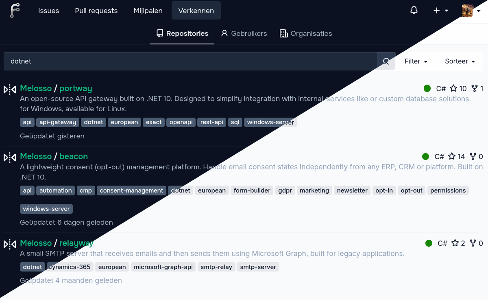

# Mirror script for [Forgejo](https://forgejo.org/)

A lightweight companion script for Forgejo that restores its' engagement metrics to mirrored repositories by pulling live Star and Fork counts from the original source.



> Designed to work seamlessly with [our brand-inspired Melosso Forgejo Theme](https://github.com/melosso/forgejo-theme-melosso).

## Why?

Forgejo mirrors only synchronize Git data, leaving social metrics like stars and forks at zero. This makes it difficult to see a project's popularity or "social proof" at a glance on your local instance.

This script fills those gaps by fetching live engagement data from the original source (GitHub, GitLab, etc.) and overlaying it onto your Forgejo UI. All fetched metrics are cached locally for 24 hours to ensure your instance stays fast and respects API rate limits.

The script has universal support for GitHub, GitLab, GitBucket, and Gitea-based instances. It automatically identifies mirrors through the Forgejo API and adds a small snippet to your custom header template.

## Installation

Add the contents of [mirror-meta.js](mirror-meta.js) to your Forgejo custom header template.

1. Use an editor to create or edit the `custom/templates/custom/header.tmpl` file
2. Make sure to keep the code in the `<script>` tag
3. Restart Forgejo:

   ```bash
   sudo systemctl restart forgejo
   ```

## Configuration

Edit the top of the script to toggle features:

```javascript
const enableStars = true;
const enableForks = true;

// If you don't like to use animations:
const useAnimation = true;
```

## License

Published and licensed under the [AGPL-3.0 license](./LICENSE.md).